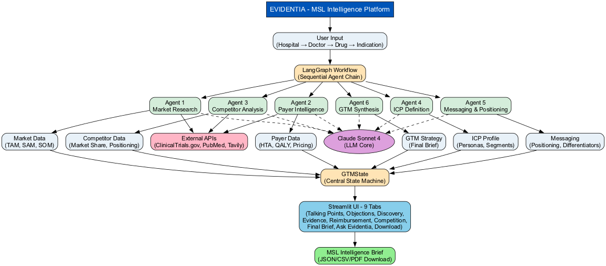

# 🏥 Evidentia - AI-Powered MSL Pre-Call Intelligence Briefs



**AI-powered Medical Science Liaison (MSL) intelligence platform that generates complete pre-call briefs in 90 seconds using multi-agent LangGraph architecture.**

---

## 🎯 What is Evidentia?

Evidentia is a **Sales Enablement AI** for pharmaceutical Medical Science Liaisons. It automates the research and intelligence gathering needed before hospital calls, transforming 30-45 minutes of manual work into a 90-second AI-powered brief.

### Problem Solved
❌ MSLs spend 30-45 mins researching before each call  
❌ Inconsistent talking points across field teams  
❌ Risk of missing key objections or competitive gaps  
❌ Slow onboarding of new MSL team members  

### Solution
✅ AI-generated briefs in 90 seconds  
✅ Consistent, data-backed messaging  
✅ Pre-loaded objection responses  
✅ Day-1 productivity for new MSLs  

---

## ✨ Key Features

### 🏥 Real US Hospital Database
- 8 major cancer centers (MD Anderson, Memorial Sloan Kettering, Mayo Clinic, Cleveland Clinic, Dana-Farber, UCSF, Johns Hopkins, Stanford)
- Real oncologist names & specialties per hospital
- Dynamic doctor selection dropdowns

### 🧠 Multi-Agent Intelligence System
6 specialized LangGraph agents working sequentially:
1. **Market Research Agent** - Clinical trials, epidemiology, TAM/SAM/SOM
2. **Payer Intelligence Agent** - HTA status, QALY thresholds, reimbursement criteria
3. **Competitor Analysis Agent** - Market positioning, competitive gaps
4. **ICP Definition Agent** - Ideal customer profile, buyer personas
5. **Messaging & Positioning Agent** - Value propositions, differentiators
6. **GTM Synthesis Agent** - Final integrated strategy

### 📊 9 Interactive Tabs
| Tab | Purpose |
|-----|---------|
| 💬 **Talking Points** | Key messages, positioning, messaging pillars |
| ⚠️ **Objection Handling** | Pre-loaded responses to doctor objections |
| ❓ **Discovery Questions** | Guided questions to uncover doctor needs |
| 📊 **Clinical Evidence** | Trial data, market sizing, patient population |
| 💰 **Reimbursement** | HTA status, QALY, pricing, access restrictions |
| 🏆 **Competitive Position** | Competitor analysis, our advantages |
| 📋 **Final Brief** | Executive summary for pre-call review |
| 💬 **Ask Evidentia** | Natural language Q&A (Claude-powered) |
| 📥 **Download Brief** | Export as JSON/CSV/PDF |

### 💬 Ask Evidentia - Natural Language Q&A
Ask questions in plain English:
- "What if the doctor asks about side effects?"
- "How do we compare to pembrolizumab?"
- "What's our pricing strategy?"

Claude AI answers in real-time, referencing the brief data.

---

## 🏗️ Architecture
```
┌─────────────────────────────────────────────────────────────────┐
│                    USER INPUT (Sidebar)                          │
│      Hospital → Doctor → Drug Name → Indication                 │
└────────────────────┬────────────────────────────────────────────┘
                     │
                     ▼
         ┌───────────────────────────┐
         │  LangGraph Workflow       │
         │  (6 Sequential Agents)    │
         └───────────────────────────┘
          │      │      │      │      │
          ▼      ▼      ▼      ▼      ▼
        Agent  Agent  Agent  Agent  Agent
         1      2      3      4      5
        Market Payer Compet  ICP  Messaging
         Res  Intel  Analysis  Def    &
                                    Position
          │      │      │      │      │
          └──────┴──────┴──────┴──────┘
                     │
                     ▼
              ┌──────────────┐
              │  Agent 6     │
              │  GTM Synth   │
              └──────────────┘
                     │
                     ▼
         ┌───────────────────────────┐
         │  Streamlit UI - 9 Tabs    │
         │  (Interactive Brief)      │
         └───────────────────────────┘
                     │
                     ▼
         ┌───────────────────────────┐
         │ MSL Intelligence Brief    │
         │ (JSON/CSV/PDF Download)  │
         └───────────────────────────┘
```

---

## 🚀 Quick Start

### Prerequisites
- Python 3.11+
- API Keys: `ANTHROPIC_API_KEY`, `TAVILY_API_KEY`
- (Optional) Docker Desktop

### Installation
```bash
# Clone repo
git clone https://github.com/LifeSciForge/Evidentia.git
cd Evidentia

# Setup environment
cp .env.example .env
# Edit .env with your API keys

# Install dependencies
pip install -r requirements.txt

# Run Streamlit app
streamlit run src/ui/app.py
```

Access: **http://localhost:8501**

---

## 📚 Usage Guide

### Step 1: Select Hospital & Doctor
```
Hospital Dropdown → MD Anderson Cancer Center
Doctor Dropdown   → Dr. Roy S. Herbst (Thoracic Medical Oncology)
```

### Step 2: Enter Drug Information
```
Drug Name:    ivonescimab
Indication:   Non-Small Cell Lung Cancer
```

### Step 3: Generate Brief
Click **🚀 Generate MSL Brief** → Wait ~90 seconds

### Step 4: Review Intelligence
- 💬 **Talking Points** - Lead with these 3 key messages
- ⚠️ **Objections** - Be prepared for these questions
- ❓ **Discovery** - Ask these to uncover needs
- 💰 **Reimbursement** - Know the payer landscape
- 🏆 **Competitors** - Understand your position
- 📋 **Final Brief** - 8-minute pre-call summary
- 💬 **Ask Evidentia** - Get answers to specific questions

### Step 5: Download & Share
Export as JSON for offline reference or team sharing

---

## 🛠️ Tech Stack

| Layer | Technology |
|-------|-----------|
| **Frontend** | Streamlit 1.55.0 |
| **Agent Framework** | LangGraph 1.1.3 + LangChain 1.2.13 |
| **LLM** | Claude Sonnet 4 (Anthropic API) |
| **Data Sources** | ClinicalTrials.gov, PubMed, Tavily Search |
| **State Management** | Pydantic TypedDict |
| **Backend** | FastAPI (optional), PostgreSQL |
| **Deployment** | Docker, Streamlit Cloud, Railway |

---

## 📊 Performance

- ⏱️ **Brief Generation:** 90 seconds
- 🔄 **Agents Processed:** 6/6 (100%)
- 📈 **Data Sources:** 3 (ClinicalTrials.gov, PubMed, Tavily)
- 💬 **Q&A Chat:** Real-time Claude responses
- 📥 **Export Formats:** JSON (ready), CSV (coming), PDF (coming)

---

## 🎯 Target Users

### Primary
- **Medical Science Liaisons (MSLs)** in oncology, immunotherapy, specialty pharma
- Field reps at large pharma (Roche, Merck, AstraZeneca, Novartis, Amgen, BMY, Eli Lilly)

### Secondary
- **Chief Medical Officers** (field readiness & messaging QC)
- **Medical Affairs Directors** (MSL onboarding & training)
- **Market Access Leaders** (payer intelligence)
- **Commercial Ops** (launch readiness metrics)

---

## 💼 Business Impact

| Metric | Impact |
|--------|--------|
| **Time Savings** | 30-45 mins per call → 2 mins |
| **Productivity Gain** | ~8 hours/month per MSL |
| **Value per MSL** | $8K-$15K annually |
| **ROI** | 100 MSLs × $10K = $1M+ annual value |
| **MSL Ramp-Up** | Week 4 productivity → Day 1 productivity |

---

## 🚀 Deployment

### Local Development
```bash
streamlit run src/ui/app.py --server.port 8501
```

### Cloud Deployment (Streamlit Cloud)
```bash
git push origin main
```
Then [deploy on Streamlit Cloud](https://streamlit.io/cloud)

### Docker
```bash
docker-compose up
```
Access: **http://localhost:8501**

---

## 📖 Documentation

- **[Architecture Diagram](docs/architecture_diagram.png)** - System design
- **[Setup Guide](docs/SETUP.md)** - Detailed installation (coming soon)
- **[Deployment Guide](docs/DEPLOYMENT.md)** - Production deployment (coming soon)

---

## 🔐 Privacy & Security

- ✅ API keys hidden in `.gitignore` (`.env` never committed)
- ✅ `.env.example` shows required variables
- ✅ No patient data stored locally
- ✅ All API calls encrypted (HTTPS)
- ✅ Session state isolated per user

---

## 📈 Roadmap

- [x] Core 6-agent system
- [x] Streamlit UI (9 tabs)
- [x] Real US hospital database
- [x] Ask Evidentia (Q&A chat)
- [ ] CSV/PDF export
- [ ] Real-time collaboration
- [ ] Mobile app
- [ ] Integration with Salesforce CRM
- [ ] Multi-language support

---

## 🤝 Contributing

This is a portfolio project showcasing:
- LangGraph multi-agent architecture
- Pharma domain expertise
- AI/ML engineering
- Streamlit fullstack development
- Clean code & documentation

Contributions welcome! Feel free to fork and submit PRs.

---

## 📝 License

MIT License - See LICENSE file for details

---

## 👤 Author

**Pranjal Das** - CSO @ Pienomial  
- GitHub: [LifeSciForge](https://github.com/LifeSciForge)
- LinkedIn: [linkedin.com/in/pranjal-das1](https://linkedin.com/in/pranjal-das1)
- Email: daspranjal.pd@gmail.com

---

## 🙏 Acknowledgments

- **Claude API (Anthropic)** - LLM backbone
- **LangGraph (LangChain)** - Agent orchestration
- **Streamlit** - UI framework
- **ClinicalTrials.gov, PubMed, Tavily** - Data sources
- **Pharma community** - Domain expertise & feedback

---

## 📬 Questions or Feedback?

Open an issue on GitHub or reach out on LinkedIn. Let's build the future of pharmaceutical AI together! 🚀
